# Analysis and Design Document

# Requirement analysis

## Assignment Specification
<!--Application description-->
Use JAVA API to design and implement an application for the front desk employees of a bank. The application should have two types of users (a regular user represented by the front desk employee and an administrator user) which have to provide a username and a password in order to use the application.

The regular user can perform the following operations:

- Add/update/view client information (name, identity card number, personal numerical code, address, etc.).
- Create/update/delete/view client account (account information: identification number, type, amount of money, date of creation).
money between accounts.
- Process utilities bills.

The administrator user can perform the following operations:
- CRUD on employees’ information.
- Generate reports for a particular period containing the activities performed by an employee.

## Function requirements
<!--Present the functional requirements-->
- The data will be stored in a database. Use the Layers architectural pattern to organize your application. Use a domain logic pattern (transaction script or domain model) / a data source hybrid pattern (table module, active record) and a data source pure pattern (table data gateway, row data gateway, data mapper) most suitable for the application.
- Do not use an Object Relational Mapper framework. Write the queries against the database in SQL.
- SQL script for creating and populating the database with initial values.
- The inputs of the application will be validated against invalid data before submitting the data and saving it in the database.

## Non-functional Requirements
<!--Discuss the non-functional requirements for the system-->
- The application should be accessible and easy to use.
- The application must be secure
- The user interface must update instantly (in under 1 second)

# Use-Case Model
<!--Create the use-case diagrams and provide one use-case description (according to the format below).-->

## Use case 1 - Add a new employee

    * Use case: add a new employee
    * Level: one of: user-goal level
    * Primary actor: admin user
    * Main success scenario: 
    1. The user opens the application
    2. The user inserts their credentials - username and password
    3. The user press the "Login" button
    4. The system prompts the user to the "Admin Menu View"
    5. The user press the "Manage Employees" button
    6. The system prompts the user to the "Manage Employees View"
    7. The user inserts a new and unique username, a password, and a role for him. With respect to the validators, the username must be     3-20 characters long, with no _ or . at the beginning not at the end no __ or _. or ._ or .. inside, and only the characters from       the sequence: [a-zA-Z0-9._] are accepted. Moreover, the pssword must be at least 4 characters long, containg at least one upper         case, at least one lower case and at least one digit. The role can be either admin or regular user.
    8. The user press the "Add Employee" button.
    9. The systems adds the new employee to the database.
    10. The system reflects the new employee from the database in the table of the GUI within 1 second.
    * Extensions: 
    4'. The user might inserted some invalid credentials, a warning alert is shown and the user must repeat the process
    4''. The user might not be the admin, and therefore he cannot add an employee. The process stops here.
    9'. The credentials does not respect the validators' rules. A warning alert will be shown and the employee is not added. The user       must rewrite the credentials until they are good.

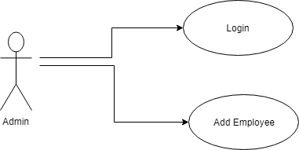

## Use case 2 - Admin User
<!--
    * Use case: transfer money between accounts
    * Level: one of: user-goal level 
    * Primary actor: regular user
    * Main success scenario:
    1. The user opens the application
    2. The user inserts their credentials - username and password
    3. The user press the "Login" button
    4. The system prompts the user to the "User Menu View"
    5. The user press the "Transfer Money" button
    6. The system prompts the user to the "Transfer Money View"
    7. The user inserts the account's id from which the money are transferred, the account's id to which the money are transferred, the     amount of money that is wanted to be transferred, and the description of the transaction if needed.
    8. The user must press the button "Send"
    9. The system adds the transaction to the database and modify the balance of both accounts.
    * Extensions: 
    4'. The user might inserted some invalid credentials, a warning alert is shown and the user must repeat the process
    4''. The user might not be the regular user, and therefore he cannot transfer money between accounts. The process stops here.
    9'. The credentials does not respect the validators' rules. The rules say that the accounts' ids and te amount of money must be         positive. A warning alert will be shown and the system does not proceed the transaction neither modifies the accounts' balances. The    user must rewrite the credentials until they are good.
    -->

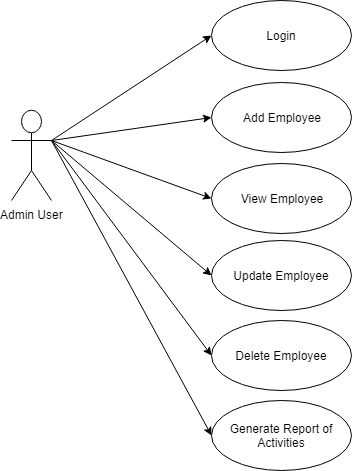

## Use case 3 - Regular User
<!--
    * Use case:  generate reports about activities performed by employees in a given period of time
    * Level: one of: user-goal level
    * Primary actor: admin user
    * Main success scenario: 
    1. The user opens the application
    2. The user inserts their credentials - username and password
    3. The user press the "Login" button
    4. The system prompts the user to the "Admin Menu View"
    5. The user press the "Generate Reports" button
    6. The system prompts the user to the "Generate Reports View"
    7. The user selects the beginning date and the ending date of which they want to generate the activities
    8. The user press the "Generate" button
    9. The system creates the pdf report and shows it.
    * Extensions: 
    4'. The user might inserted some invalid credentials, a warning alert is shown and the user must repeat the process
    4''. The user might not be the regular user, and therefore he cannot transfer money between accounts. The process stops here.
    9'. In those may not have been performed any activity, and therefore the report will not have any pages. An alert information will be shown.
-->
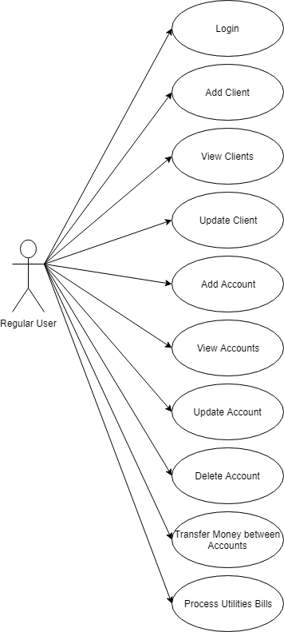

# System Architectural Design

## Architectural Pattern Description
<!--Describe briefly the used architectural patterns.-->
Desktop Application- MySQL database

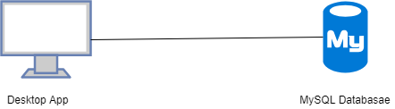

## Diagrams
<!--Create the system’s conceptual architecture; use architectural patterns and describe how they are applied. Create package, component and deployment diagrams-->

Package diagram

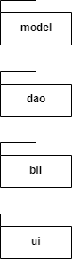

Component diagram

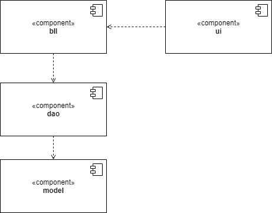

Deployment Diagram

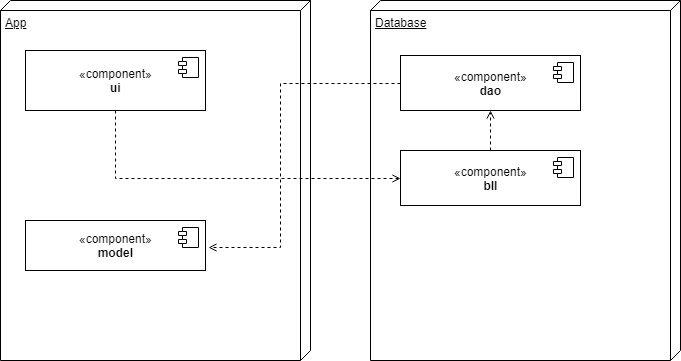

# UML Sequence Diagrams
Create a sequence diagram for a relevant scenario.

# Class Design

## Design Patterns Description
<!--Describe briefly the used design patterns.-->
Table Data Gateway

A Table Data Gateway holds all the SQL for accessing a single table or view: selects, inserts, updates, and deletes. Other code calls its methods for all interaction with the database. A Table Data Gateway has a simple interface, usually consisting of several find methods to get data from the database and update, insert, and delete methods. Each method maps the input parameters into a SQL call and executes the SQL against a database connection.The Table Data Gateway is usually stateless, as its role is to push data back and forth. The trickiest thing  about a Table Data Gateway is how it returns information from a query. 

A good practice is to use a Data Transfer Object. It’s another object to create but one that may well be used elsewhere. A Table Data Gateway thus goes very well with Table Module. If all of your updates are done through the Table Data Gateway, the returned data can be based on views rather than on the actual tables, which reduces the coupling between the code and the database.

If a Domain Model is used, the Table Data Gateway returns the appropriate domain object. I have one for each table in the database. View-based Table Data Gateways often can’t update and so won’t have update behavior. Therefore, an update method for the views is needed. 

Table Data Gateway is probably the simplest database interface pattern to use, as it maps so nicely onto a database table or record type. It also makes a natural point to encapsulate the precise access logic of the data source.

One of the benefits of using a Table Data Gateway to encapsulate database access is that the same interface can work both for using SQL to manipulate the database and for using stored procedures. Indeed, stored procedures themselves are often organized as Table Data Gateways. That way the insert and update stored procedures encapsulate the actual table structure. The find procedures in this case can return views, which helps to hide the underlying table structure.

Table Module

A Table Module represents a single instance that handles the business logic for all rows in a database table or view.

A Table Module organizes domain logic with one class per table in the database, and a single instance of a class contains the various procedures that will act on the data. 

The strength of Table Module is that it allows to package the data and behavior together and at the same time play to the strengths of a relational database. 
Usually, Table Module is used with a backing data structure that’s table oriented. The tabular data is normally the result of a SQL call and is held in a Record Set that mimics a SQL table. The Table Module gives you an explicit method-based interface that acts on that data. Grouping the behavior with the table gives many of the benefits of encapsulation in that the behavior is close to the data it will work on. Often it is needed the behavior from multiple Table Modules in order to do some useful work. Many times you see multiple Table Modules operating on the same Record Set. The most obvious example of Table Module is the use of one for each table in the database. However, if there are interesting queries and views in the database, then Table Modules can be for them as well.

The Table Module may be an instance or it may be a collection of static methods. The advantage of an instance is that it allows you to initialize the Table Module with an existing record set, perhaps the result of a query. You can then use the instance to manipulate the rows in the record set. Instances also make it possible to use inheritance, so we can write a rush contract module that contains additional behavior to the regular contract. The Table Module may include queries as factory methods. 

When a Table Data Gateway is used, the application first uses the Table Data Gateway to assemble data in a Record Set. It can be created a Table Module with the Record Set as an argument. If there is needed the behavior from multiple Table Modules, they can be created with the same Record Set . The Table Module can then do business logic on the Record Set and pass the modified Record Set to the presentation for display and editing using the table-aware widgets. After modification in the GUI, the data set goes back to the Table Module for validation before it’s saved to the database. One of the benefits of this style is that the Table Module can be tested by creating a Record Set in memory without going to the database. The word “table” in the pattern name suggests that there is one Table Module per table in the database. 

Indeed, the structure of the Table Module doesn’t really depend on the structure of tables in the database but more on the virtual tables perceived by the application, including views and queries.

## UML Class Diagram
<!--Create the UML Class Diagram and highlight and motivate how the design patterns are used.-->

The first diagram represents the full class diagram:

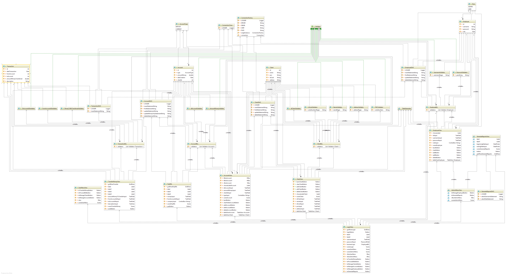

Due to the high dimension, complexity of the diagram and also for a better visibility I will divide the diagram into parts:

The model part:

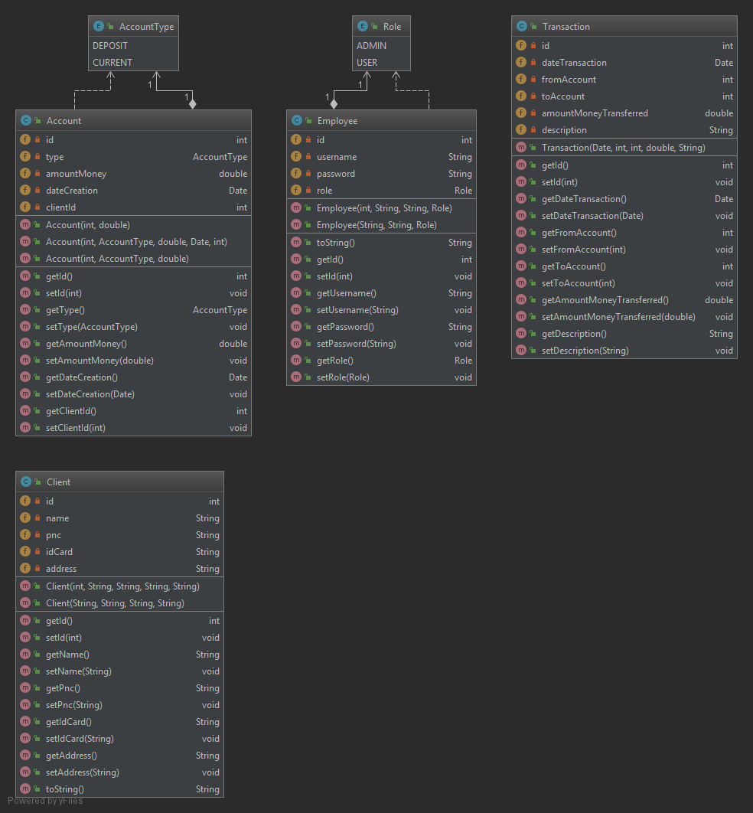

Here I designed the entities of the database. Each one has special constructors, getters and setters. 

The Table Date Gateway part:

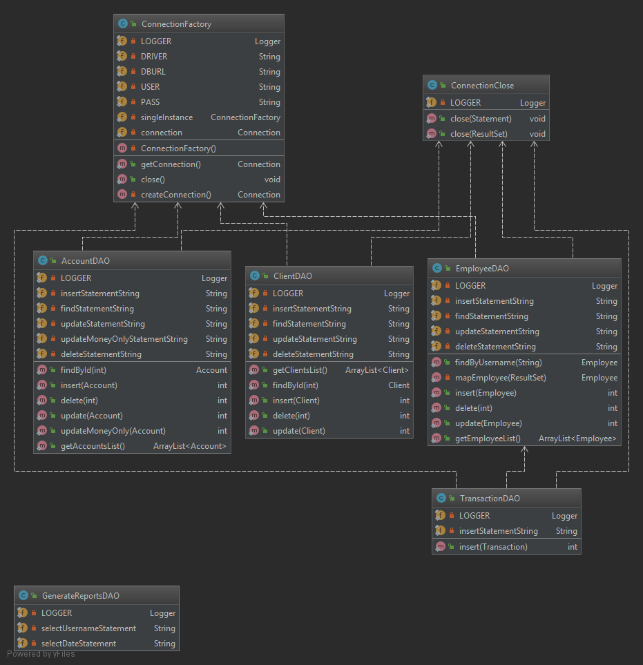

In this section I created the CRUD(Create, Read, Update, Delete) and the find option based on SQL Statements Strings.
Moreover, in this section the connection with the database is made through String statements. 

The Table Module part:

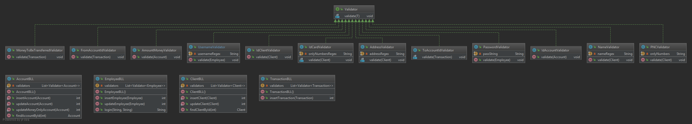

In this part I designed the classes which assures that the data input is conform to the small validator. 
The Table Data Gateway is filtred through the Table Module part.
Small validators reffers to the validators which are made only for a certain problem. (ex: PNC, Address, Name, etc)
They are referred in the Table Module part.

The GUI part:

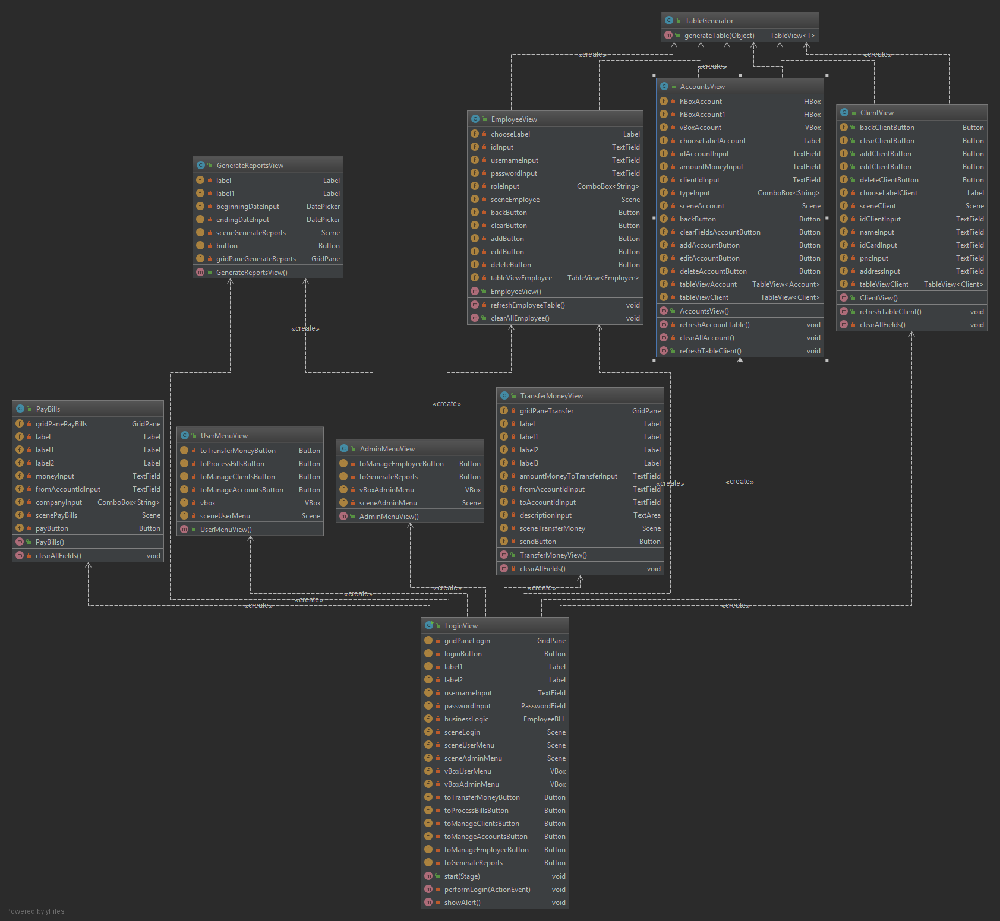

These represent the GUI classes made by code. There is only one application, and the rest ones extends VBox, GridPane, etc, they are children to the parent/ root class. 

# Data Model
<!--Present the data models used in the system’s implementation.-->

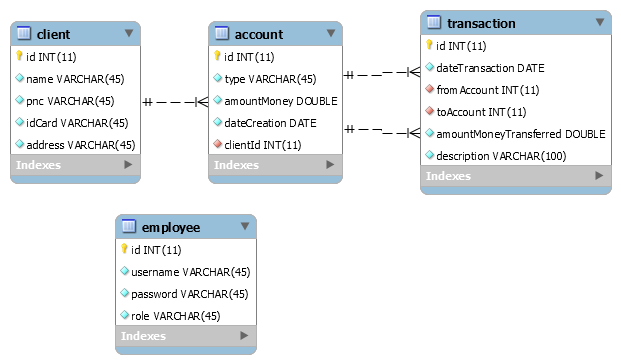

My database contains 4 tables. Consideridering each one:  
- Employee table - it contains the employees' id, username, password and the role. 
- Client table - it contains the clients' information, such as their id, name, pnc, idCard and address. 
- Account table - contains information about the accounts, such as the id, type, amount of money, date of creation and the client id who has the respective account.  
- Each client can have multiple accounts, but one account can only have one holder. 
- Transaction table - keeps the data from each transaction: id, date of transaction, from account, to account, amount of money which were transferred and the description of each transaction. 
- Each account can have multiple transactions, but one transaction can have only be created once.  
- The Transaction table has two foreign keys, because it considers the account from which is made the transfer and also the account to  which are the money transferred.

# System Testing
<!--Present the used testing strategies (unit testing, integration testing, validation testing) and testing methods (data-flow, partitioning, boundary analysis, etc.).-->

The system testing was performed by using unit testing for the Table Data Gateway, integration testing for the integration of the client with the server, and validation testing for the finished system. The unit testing was
performed using jUnit in the TestCases classes. Integration testing was performed using the graphical user interface, by
testing each functionality in turn for main success and fail scenarios (data-flow strategy). Each Use Case has been tested using the data-flow strategy. I tested for the main success scenarios and several fail scenarios.

# Bibliography
<!-- - [Online diagram drawing software](https://yuml.me/) ([Samples](https://yuml.me/diagram/scruffy/class/samples))-->
- [Online Diagram Drawing](https://www.draw.io)
- [Martin Fowler et. al, Patterns of Enterprise Application Architecture, Addison Wesley, 2003](http://training.hasintech.com/download/attachments/1802696/Patterns%20of%20Enterprise%20Application%20Architecture%20-%20Martin%20Fowler.pdf?version=1&modificationDate=1464702352696&api=v2)
- [JavaFx](https://docs.oracle.com/javase/8/javafx/get-started-tutorial/index.html)
- [Client-Server](https://en.wikipedia.org/wiki/Client%E2%80%93server_model)
